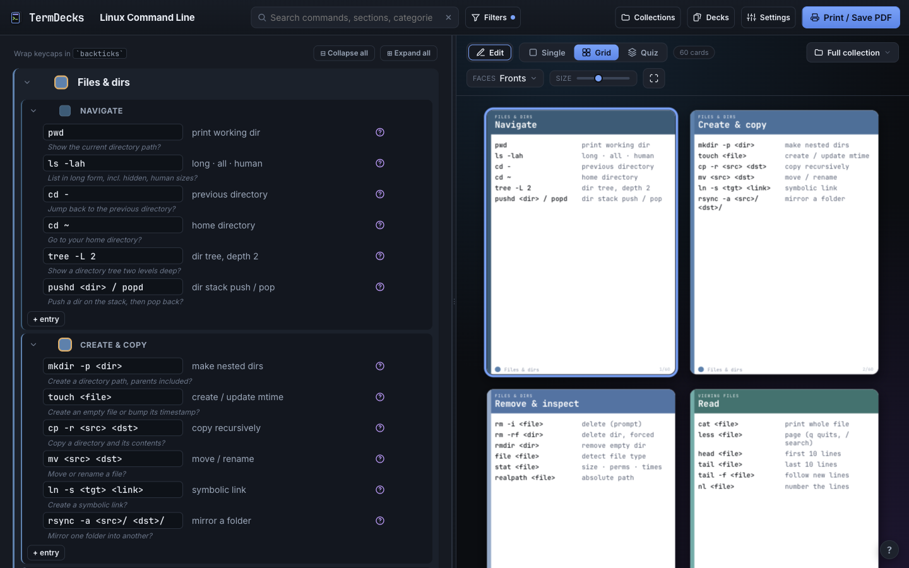
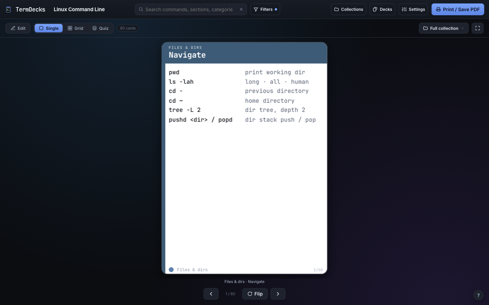
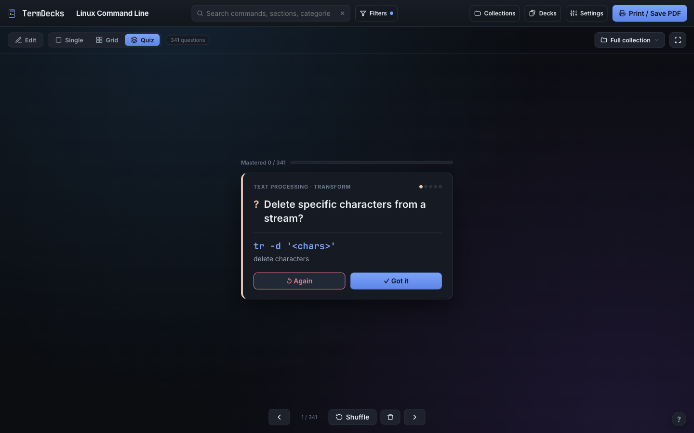
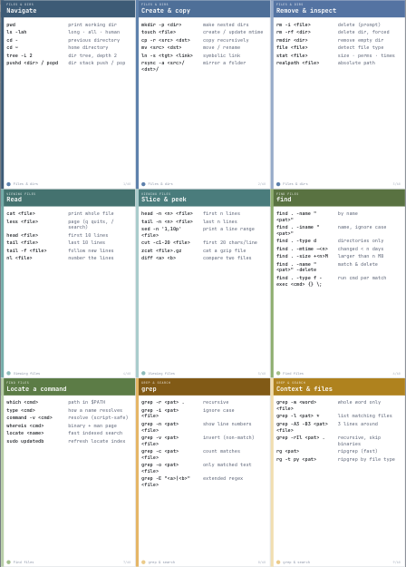
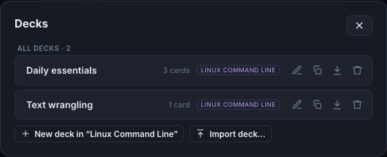

# TermDecks

**Build printable, poker-sized reference cards for the terminal, then study them with a built-in spaced-repetition quiz.**

TermDecks turns a list of commands into a real deck of cards. Group commands into categories and sections, tweak the look, and print a double-sided deck you can cut out and keep by your keyboard. Or flip through them on screen and drill yourself until they stick.

It's a single, dependency-free `index.html`. No build step, no server, no account. Everything lives in your browser's local storage.



---

## Highlights

- 🗂️ **Structured editor**: Categories → Sections → Entries (command + description + optional question). Drag to reorder or move between sections, duplicate, collapse, recolor. Keyboard-first: `cmd → desc → question → next entry`, all without the mouse.
- 🃏 **Designed cards**: each section becomes a poker-sized card (2.5″ × 3.5″), spilling onto extra cards when its entries don't all fit. Front = the commands; back = the section's questions. Backtick-wrapped keycaps render as `kbd` chips.
- 🖨️ **Print / Save PDF**: lays cards out 9-up (3×3) per sheet with mirrored backs for double-sided printing, cut guides, US-Letter or A4. What you see (search + filters) is what prints.
- 🧠 **Quiz mode with spaced repetition**: a Leitner-box study loop. Reveal the answer, grade *Again* / *Got it*, and weak cards resurface far more often than mastered ones. Tracks mastery per collection; shuffle and reset on demand.
- ◆ **Two card-back styles**: *Questions* (study-forward) or *Navigator* (a bold category band for sorting a fanned/stacked deck), with the questions always visible.
- 📦 **Collections & Decks**: keep multiple libraries; carve any library into named **decks** (the sections you pick, which become its cards). A dedicated Decks window manages every deck across all collections, so you can create, rename, delete, copy between collections, and import/export individual decks.
- ➕ **Expansions**: twelve ready-made decks to start from or fold into your own. Linux is the base starter; the rest layer on top, adding only the depth the base leaves out. Terminal fundamentals: SSH & remote, Bash & zsh power, HTTP & APIs, Archives & transfer. Tools: DevOps, AI-Assisted Engineering, Vim & Neovim, tmux, Git (deep), jq + awk/sed/grep. Plus Terminal Toys for fun.
- 📑 **CSV & JSON import/export**: bring commands in from a spreadsheet, or back up everything to a file. A "Back up all" / "Delete all" pair lives in Settings.
- 🎨 **Themes & fonts**: Auto/Nord/Catppuccin/Solarized/Pastel/Vibrant/Graphite palettes; JetBrains Mono, IBM Plex Mono, Fira Code, or system monospace.

---

## Screenshots

| A single card | Quiz / study mode |
|:---:|:---:|
|  |  |

| Print sheet (3×3, ready to cut) | The Decks window |
|:---:|:---:|
|  |  |

---

## Run it

It's one self-contained file. Just open it.

```bash
# clone, then open in a browser
git clone https://github.com/zntznt/termdecks.git
cd termdecks
open index.html        # macOS  (or: xdg-open index.html on Linux)
```

To print, click **Print / Save PDF** and choose your printer or "Save as PDF" in the print dialog. For double-sided cards, set your printer to flip on the **long edge** (the default); use **short edge** if the backs come out upside-down.

> File-based auto-backup ("Sync to file" in Collections) uses the File System Access API, available in Chromium-based browsers (Chrome/Edge). Everything else works everywhere.

---

## How it's organized

```
Collection                     a library (e.g. "Linux Command Line")
└─ Category                    a colored group (e.g. "Files & dirs")
   └─ Section                  → becomes one or more cards (e.g. "Navigate")
      └─ Entry                 a command + description + optional question
```

- A **section** becomes a card, and if its entries don't all fit, it spills onto extra cards (each footed *page N of M*). The front lists the section's entries; the back shows their questions.
- A **deck** is a named subset of one collection's sections (those sections become the deck's cards). Pick the ones you want with **Select cards** in the viewer.
- **Quiz mode** is a viewer feature, not a card property: it never changes how cards render or print.

### Keyboard shortcuts

| Key | Action |
|---|---|
| `/` | Focus search |
| `←` `→` | Previous / next card |
| `F` | Flip the current card |
| `Space` | Quiz: reveal the answer |
| `1` `2` | Quiz: grade *Again* / *Got it* |
| `S` | Quiz: reshuffle |
| `Enter` | Editor: next field, then add a new entry |
| `Tab` | Editor: move between fields (from a description, into its question) |
| `Esc` | Clear search / close menus |

---

## Data & privacy

Everything is stored locally in your browser (`localStorage`, plus IndexedDB for the optional file-sync handle). Nothing is sent anywhere; there's no backend. Use **Settings → Back up all** to export every collection and your study progress to a single JSON file, and the Collections / Decks windows to import or export individual pieces.

The only network requests are to Google Fonts for the card typefaces.

---

## Tech

A single `index.html`: vanilla JavaScript, hand-rolled SVG icons, and CSS. No frameworks, no build tooling, no dependencies. Cards, the on-screen preview, and the print layout all share the same DOM so the preview is a faithful proof of the print.

## License

[MIT](LICENSE).
